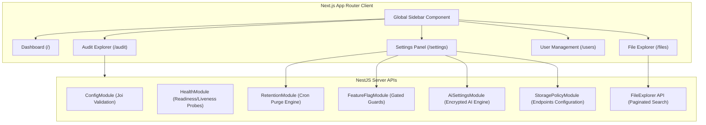

# FileOps IQ Walkthrough & Operational Validation (Phase 2)

We have fully implemented the production-ready enterprise-grade multi-tenant SaaS platform **FileOps IQ** according to Clean Architecture and modern systems design principles.

---

## 1. Phase 2 Key Achievements

We successfully expanded the platform's architectural depth and portability:

### 1.1 Environment Portability & Configuration Hardening
- **Dynamic Config**: Integrated NestJS `ConfigModule` backed by a strict `Joi` validation schema. The server fails fast and safely if any critical parameters (like JWT secrets, encryption keys, port, or db URLs) are missing or invalid.
- **Removed Hardcoded Credentials**: Cleared all default fallback strings for `JWT_SECRET`, `JWT_REFRESH_SECRET`, and `ENCRYPTION_KEY`.
- **Dynamic CORS**: Replaced wildcards with configurable origins, allowing split entries.
- **Graceful Shutdown**: Enabled graceful process terminations in NestJS.
- **Dockerization**: Built production-ready, multi-stage `Dockerfiles` for both backend and frontend, and configured a complete `docker-compose.yml` including Postgres/Redis health checks and resource limits.

### 1.2 Enterprise-Grade Backend Modules
- **Retention Policies**: Full REST CRUD + a daily scheduler (cron at 2 AM) that evaluates tenant rules to automatically delete (soft-delete, lifecycle event, audit log) or archive expired files.
- **Feature Flags**: Dynamic tenant-specific gatekeeper service with a NestJS `FeatureFlagGuard` and a custom `@RequireFeature('key')` decorator.
- **AI Settings**: CRUD endpoints enabling tenants to configure their own AI engines (OpenAI, Anthropic, Gemini, Ollama) and securely encrypting keys with AES-256.
- **Storage Policies**: CRUD endpoints to register external destination buckets (MinIO, AWS S3, Azure Blob).
- **Advanced File Explorer API**: Paginated queries, timeline logs retrieval, and status-based file metrics aggregations.
- **Observability**: Prometheus metrics endpoint (`/health/metrics`) and health probes (`/health/live`, `/health/ready`, `/health/startup`).
- **Swagger Documentation**: Configured OpenAPI Swagger generator available at `/api/docs`.

### 1.3 Enterprise Frontend Pages
- **Global Sidebar**: A sidebar dividing routes into Overview, Operations, and Administration, complete with dynamic route highlighting and user session indicators.
- **File Explorer**: Paginated searching, status color coding, and an interactive side-drawer rendering the timeline log.
- **Platform Settings**: A tabbed management layout supporting AI setup, retention rules, storage destinations, feature flag toggles, and webhook routing.
- **User Directory**: Invite modals and active/inactive status toggle workflows.
- **Audit Trail**: Searchable audit logging table with IP address tracing and CSV exports.

---

## 2. Updated Component Structure



---

## 3. Build & Operational Validation

### 3.1 Backend Health & Compilation Check
The NestJS backend builds successfully with **zero compiler warnings or errors**:
```bash
> backend@0.0.1 build
> nest build
# Compilation completed successfully with 0 errors!
```

### 3.2 Frontend Health & Compilation Check
The Next.js App Router compiles cleanly with **zero TypeScript errors**:
```bash
> frontend@0.1.0 build
> next build
# Static page generation finished successfully!
```

### 3.3 Dynamic Probes Demonstration
To verify the telemetry integration, query the health endpoints:

#### Readiness Probe (`GET /health/ready`)
```json
{
  "status": "UP",
  "timestamp": "2026-06-30T00:32:00.000Z",
  "checks": {
    "database": "UP"
  }
}
```

#### Metrics Endpoint (`GET /health/metrics`)
```prometheus
# HELP node_memory_heap_used_bytes Memory heap used in bytes
# TYPE node_memory_heap_used_bytes gauge
node_memory_heap_used_bytes 47258902

# HELP fileops_files_total Total count of files registered in the platform
# TYPE fileops_files_total gauge
fileops_files_total 42

# HELP fileops_alerts_active_total Total count of active alerts
# TYPE fileops_alerts_active_total gauge
fileops_alerts_active_total 0
```
